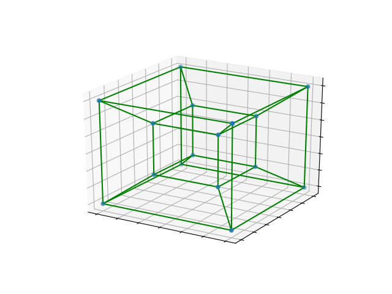

# Cube

A Python script that generates a 3D projection of an n-dimensional hypercube.
# Requirements
* Python 3
* matplotlib
* numpy
# Notes
The program will probably crash if you set n greater than 8.
